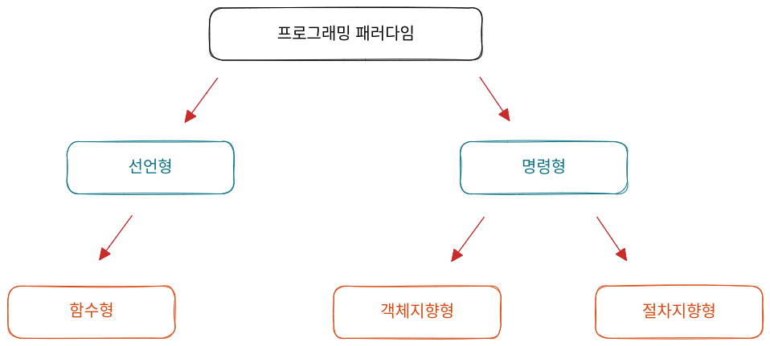

# 프로그래밍 패러다임

- `프로그래밍 패러다임(Programming Paradigm)`은 프로그래머에게 프로그래밍의 관점을 가지게 해주는 역할을 하는 개발 방법론
  <br>
  

```
- 객체지향 프로그래밍 : 프로그래머들이 프로그램을 상호 작용하는 객체들의 집합
- 함수형 프로그래밍 : 상태 값을 지니지 않은 함수 값들의 연속
```

## 선언형과 함수형 프로그래밍

- `선언형 프로그래밍(declarative programming)` 란 '무엇을' 풀어내는가에 집중하는 패러다임 이고 "프로그램은 함수로 이루어진 것이다" 라는 명제가 담겨 있는 패러다임
- `함수형 프로그래밍(functional programming)` 이란 선언형 프로그래밍의 일종
  - 함수형 프로그래밍은 작은 `순수 함수` 들을 블록처럼 쌓아 로직을 구현하고 `고차 함수`를 통해 재사용성을 높인 프로그래밍이다.

### 순수함수

- 출력이 입력에만 존재하는 것을 의미

```js
const pure = (a, b) => {
  return a + b;
};
```

이처럼 pure 함수는 들어오는 매개변수 a,b 의 영향만 받는다. 만약 a,b 말고 다른 전역 변수 c,... 등에 의해 영향을 받을 경우 `순수함수`가 아니다.

### 고차함수

- 고차함수란 함수가 함수를 값처럼 매개변수로 받아 로직을 생성할 수 있는것을 말한다.
- 일급객채 : 고차 함수를 쓰기 위해서는 해당 언어가 일급 객체라는 특징을 가져야한다.
  - 변수나 메서드에 함수를 할당할 수 있다.
  - 함수 안에 함수를 매개변수로 담을 수 있다.
  - 함수가 함수를 반환할 수 있다.

## 객체지향 프로그래밍

- `객체지향 프로그래밍(OOP, Object-Oriented-Programming)` 은 객체들의 집합으로 프로그램의 상호작용을 표현하며 데이터를 객체로 취급하여 객체 내부에 서언된 메서드를 활용하는 방식
- 설계에 많은 시간이 소요되며, 처리 속도가 다른 프로그래밍 패러다임에 비해 느리다.

### 객체지향 프로그래밍의 특징

- `추상화`, `캡술화`, `상속성`, `다형성` 이라는 특징이 있다.

- 추상화(abstraction)

  - 복잡한 시스템으로부터 핵심적인 개념 또는 기능을 간추려내는 것을 의미
  - Ex) 남동생이 군인, 상병, 키 180 이상, 여친 없음, 라섹함 이라는 특징이 있다.
    이러한 특징을 코드로 나타낼 때 특징 중 하나인 여친 없음, 라섹함만 뽑아내거나 더 간추리는 것을 의미한다.

- 캡슐화(encapsulation)

  - 객체의 속성과 메서드를 하나로 묶고 일부를 외부에 감추어 은닉 하는것을 의미

- 상속성(inheritance)

  - 상위 클래스의 특성을 하위 클래스가 이어 받아 재사용하거나 추가, 확장하는 것을 의미
  - 코드의 재사용 측면, 계측적인 관계 생성, 유지 보수성 측면에서 중요

- 다형성(polymorphism)
  - 하나의 메서드나 클래스가 다양한 방법으로 동작하는 것을 말한다.
  - 대표적으로 [오버로딩, 오버라이딩](#오버로딩-오버라이딩) 이 있다.

### 설계 원칙

- 객체지향 프로그래밍을 설계할 때는 `SOLID 원칙`을 지켜야 한다.

`단일 책임 원칙 (SRP, Single Responsibility Principle)`

- 모든 클래스는 각각 하나의 책임만 가져야 한다.

`개방-폐쇄 원칙 (OCP, Open Closed Principle)`

- 유지 보수 사항이 생긴다면 코드를 쉽게 확장할 수 있도록 하고, 수정할 때는 닫혀 있어야 하는 원칙
- 기존의 코드는 잘 변경하지 않으면서 확장은 쉽게 할 수 있어야 한다.

`리스코프 치환 원칙(LSP, Liskov Substitution Principle)`

- 프로그램의 객체는 프로그램의 정확성을 깨트리지 않으면서 하위 타입의 인스턴스로 바꿀 수 있어야 하는것을 의미
- 클래스는 상속이 되기 마련이고 부모, 자식이라는 계층 관계가 만들어진다. 이때 부모 객체에 자식 객체를 넣어도 시스템이 문제 없이 돌아가게 만드는 것을 말한다.
- Ex) 길동 객체가 석봉 객체의 자식 계층일때 길동 객체를 석봉 객체로 바꾸어도 문제가 없어야 한다.

`인터페이스 분리 원칙(ISP, Interface Segregation Principle)`

- 하나의 일반적인 인터페이스보다 구체적인 여러 개의 인터페이스를 만들어야 하는 원칙

`의존 역전 원칙(DIP, Dependency Inversion Principle)`

- 자신보다 변하기 쉬운 것에 의존하던 것을 추상화된 인터페이스나 상위 클래스를 두어 변하기 쉬운 것의 변화에 영향 받지 않게 하는 원칙을 말한다.
- Ex) 타이어를 갈아 끼우기 위해 틀을 만들어 놓은 후 다양한 타이어를 교체할 수 있어야 한다.
  즉 상위 계층은 하위 계층의 변화에 대한 구현으로부터 독립해야 한다.

## 절차형 프로그래밍

- 절차형 프로그래밍은 로직이 수행되어야 할 연속적인 계산과정으로 이루어져 있다.
- 일이 진행되는 방식으로 그저 코드를 구현하기만 하면 되기에 코드의 가독성이 좋으며 실행 속도가 빠르다.
  그렇기에 계산이 많은 작업에 쓰이지만, 단점으로는 모듈화하기가 어렵고 유지 보수성이 떨어진다.

## 패러다임의 혼합

어떤 패러다임이 좋은가에 대한 답은 없다.
비지니스 로직이나, 서비스 특징을 고려해서 패러다임을 정하는 것이 좋다.
하나의 패러다음을 기반으로 서비스를 구축하는 것도 좋지만 여러 패러다임을 조합하여 상황과 맥락에 따라 패러다임간의 장점만 취해 개발하는 것이 좋다.

### 오버로딩, 오버라이딩

```
오버로딩
같은 이름을 가진 메서드를 여러개 두는 것을 말한다.
메서드의 타입, 매개변수의 유형, 개수 등으로 여러개를 둘 수 있으며 컴파일 중에 발생하는 정적 다형성

오버라이딩
상위 클래스로부터 상속받은 메서드를 하위 클래스가 재정의하는것을 의미 한다.
런타임 중에 발생하는 동적 다형성

결론
오버로딩(Overloading)은 기존에 없던 새로운 메서드를 정의하는 것이고,
오버라이딩(Overriding)은 상속받은 메서드의 내용만 변경하는 것이다.
```
